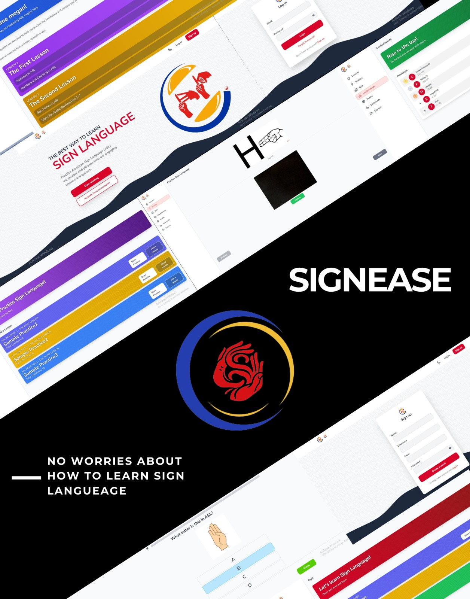
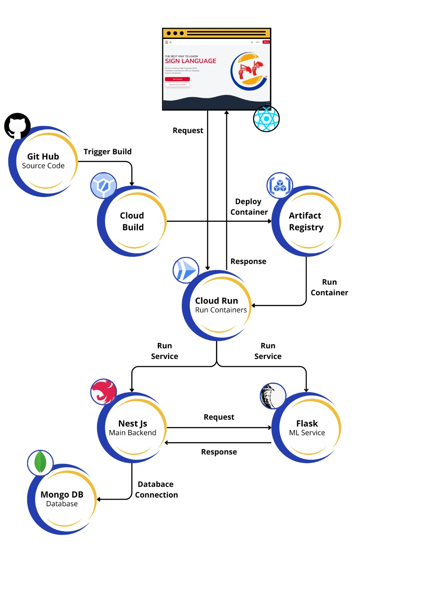

# Sign Language Learning Application

## Overview

Communication is a crucial aspect of daily life. For individuals with hearing and speech impairments, sign language serves as a primary means of communication, allowing them to interact with the world around them. However, learning sign language can be challenging due to limited access to resources and lack of interactivity, making the learning process less effective and engaging.

To address these challenges, we have designed _SignEase_, a technology-based application that utilizes artificial intelligence (AI) to assist individuals with hearing and speech impairments in learning sign language. By using gesture recognition technology, SignEase provides an interactive and enjoyable learning experience for its users.

## About SignEase

  

  

_SignEase_ is a machine learning-powered application designed to assist individuals with hearing and speech impairments in learning sign language. The application utilizes image classification to interpret sign language gestures and provides users with interactive lessons and feedback. By leveraging machine learning algorithms, SignEase aims to make learning sign language accessible, engaging, and effective.

## SignEase Features

### 📹 Video Lessons

SignEase offers a comprehensive library of video lessons designed to teach users the basics of sign language. Each video is crafted by expert sign language instructors, providing clear and concise demonstrations of various gestures and signs. Users can watch, rewind, and replay these videos as many times as they need to fully understand each sign.

### ✋ Practice Sessions

To reinforce learning, SignEase includes interactive practice sessions. Users can practice the signs they have learned by using their device's camera. The app uses advanced gesture recognition technology to provide real-time feedback, ensuring that users are performing the signs correctly. This hands-on approach helps solidify the user's understanding and mastery of sign language.

### 📝 Quizzes

To assess the user's progress and understanding, SignEase features a variety of quizzes. These quizzes range from multiple-choice questions to practical sign language tests. Users can test their knowledge and receive instant feedback on their performance. Quizzes are designed to be both challenging and fun, motivating users to continue learning and improving their skills.

### 🏆 Leaderboard

SignEase includes a leaderboard feature that adds a competitive element to the learning process. Users can see how they rank against other learners based on their quiz scores and practice session performances. The leaderboard fosters a sense of community and encourages users to stay engaged and motivated. By competing with peers, users are driven to continually improve and achieve higher scores.

## Demo Application

https://github.com/user-attachments/assets/eeb51c28-4fcf-48f1-ab29-520a9cd46ed0

Link youtube: https://youtu.be/eINxmsUpqgo?si=qI_z7myS8Uj-UCQ1

### Try Our App

Try out our application:
[https://sign-ease-frontend.vercel.app](https://sign-ease-frontend.vercel.app/)

## Built with

- **Machine Learning:**

  - Python
  - TensorFlow
  - Google Colab
  - YOLO

- **Frontend Development:**

  - Figma
  - React
  - JavaScript
  - TailwindCSS
  - Axios
  - Tanstack/React-query
  - Redux

- **Backend & DevOps Development:**
  - Google Cloud Run
  - Vercel
  - MongoDB Atlas
  - Docker
  - NestJS
  - Flask

## The system architecture

  

Two backend services were developed for the SignEase
application. The rst, an ML backend using Python Flask, predicts sh types via a
`POST /predict` endpoint. The second, a main backend using TypeScript and
NestJS, handles registration, login, email verification, password recovery, Video Lessons, Quizzes, and Practice Sessions. It communicates
with the ML backend to process sh images and retrieve labels, providing relevant
information. Both services are deployed on GCP using Cloud Run, MongoDB Atlas,. CI/CD pipelines with GitHub, Docker, and
Cloud Build support staging (master branch) and production (main branch)
environments, with Cloud Build creating Docker images for Cloud Run deployment.

## Team Members

| Member                   | Student ID | Role                       | Class               |
| ------------------------ | ---------- | -------------------------- | ------------------- |
| Anissa Tri Lahitani      | 1217050015 | Backend Developer          | Prak ML A & Teori A |
| Fiki Aprian              | 1217050058 | Fullstack Developer        | Prak ML C & Teori B |
| Megan Madellin           | 1217050078 | Writer/Researcher          | Prak ML H & Teori C |
| Mohammad Ezra Nur Islami | 1217050083 | Machine Learning Developer | Prak ML H & Teori C |

### Detail About Our Members

- **Anissa Tri Lahitani**

  - Role: Backend Developer
  - Interests & Activities: Passionate about backend applications for social good.
  - Portfolio: [Anissa's Portfolio](https://lahitanido26.github.io/MyPortofolio/)
  - LinkedIn: [Anissa Tri Lahitani](https://www.linkedin.com/in/anissa-tri-lahitani)
  - GitHub: [Anissa's GitHub](https://github.com/lahitanido26)

- **Fiki Aprian**

  - Role: Fullstack Developer
  - Interests & Activities: Passionate about machine learning and cloud computing, with a focus on developing solutions for social impact.
  - Portfolio: [Fiki's Portfolio](https://my-portofolio-fikiap23.vercel.app)
  - LinkedIn: [Fiki Aprian](https://www.linkedin.com/in/fiki-aprian-b8624b216/)
  - GitHub: [Fiki's GitHub](https://github.com/fikiap23)

- **Megan Madellin**

  - Role: Writer/Researcher
  - Interests & Activities: As a writer and researcher in sign language, I develop educational content, write about advancements, and analyze feedback to improve learning tools and methods.
  - Portfolio: -
  - LinkedIn: [Megan Madellin](https://www.linkedin.com/in/megan-medellin-884180287/)
  - GitHub: [Megan's GitHub](http://github.com/meganmedellin)

- **Mohammad Ezra Nur Islami**
  - Role: Machine Learning Developer
  - Interests & Activities: Interested in developing machine learning solutions to address real-world challenges.
  - Portfolio: [Ezra's Portfolio](https://heyzra.github.io/hizra.github.io/)
  - LinkedIn: [Mohammad Ezra Nur Islami](https://www.linkedin.com/in/mohammad-ezra/)
  - GitHub: [Ezra's GitHub](https://github.com/heyZra)

## Additional Resources

### Repository Branches

In our project is divided into four branches:

- [Machine Learning](https://github.com/MachineL-Group/Machine-Learning-Project.git) || [Backend Machine Learning](https://github.com/MachineL-Group/backend-ml.git)
- [Backend](https://github.com/MachineL-Group/backend.git)
- [Frontend](https://github.com/MachineL-Group/frontend.git)

### 📖 Proposal Magazine

For detailed information about our project, check out our proposal magazine:
[**View Proposal**](https://www.canva.com/design/DAGEgiqntso/sw5DbRPi_M3e49yOKYTKkQ/view?utm_content=DAGEgiqntso&utm_campaign=designshare&utm_medium=link&utm_source=editor)

### 🎥 Promotion Video

Watch our promotion video to learn more about SignEase:
[**Watch Video**](https://youtube.com/shorts/TWCSoQqgUlw?feature=share)

### 📄 Research Paper

Read our research paper for an in-depth understanding of our work:
[**Read Paper**](https://docs.google.com/document/d/1deU1LgYhlwujQ6Ej4Hdu6nlf8Xsi-FcN/edit?usp=sharing&ouid=114345206565782897853&rtpof=true&sd=true)

---

## Thank you for reading!
